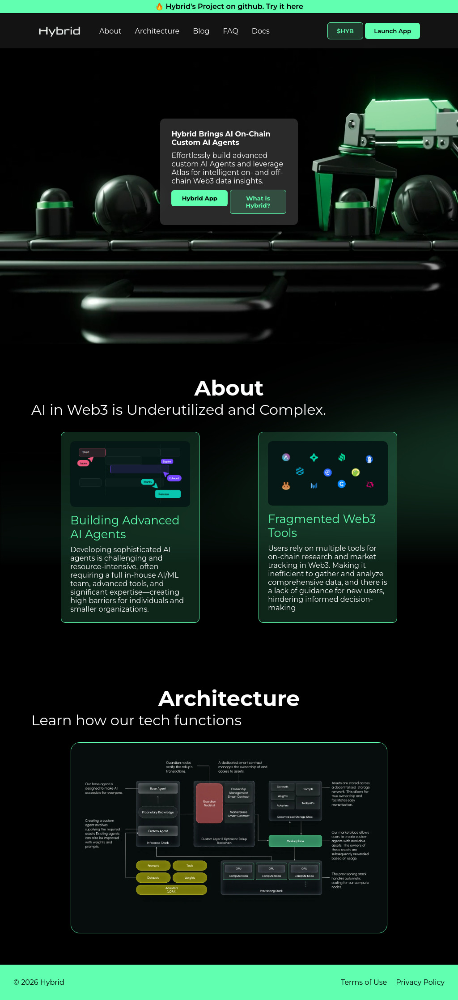

# Hybrid — The On-Chain Intelligence Layer

> A pure HTML & CSS landing page for a Web3 AI platform concept.


---

## Overview

**Hybrid** is a front-end landing page built entirely with HTML and CSS — no frameworks, no JavaScript. It showcases a fictional Web3 AI platform that brings intelligent agents on-chain, allowing users to build custom AI agents and leverage real-time blockchain data insights.

This project is part of my **HTML & CSS** practice series, focused on building real-world UI layouts from scratch.

---

## Features

- Fixed announcement bar with external link
- Glassmorphism-style header with blur effect
- Hero section with centered content card
- About section with detail cards and images
- Responsive-ready footer
- Custom Google Fonts (Montserrat)
- CSS custom color palette with a signature green accent

---

## Preview



---

## Project Structure

```
hybrid/
├── index.html
└── static/
    ├── css/
    │   └── css1000.css
    └── imgs/
        ├── background.png
        ├── bg-about.png
        ├── logo.png.png
        ├── about-1.PNG
        └── about-2.PNG
```

---

## Getting Started

No installation or build tools needed.

```bash
git clone https://github.com/0xDAA/hybrid.git
cd hybrid
# Open index.html in your browser
```

Or just open `index.html` directly in any modern browser.

---

## What I Practiced

- CSS `position: fixed` for sticky UI elements
- `backdrop-filter: blur()` for glassmorphism
- Flexbox layouts for header, sections, and footer
- CSS custom color theming with a consistent palette
- Structuring a multi-section landing page with semantic HTML

---

## Author

**Ahmed** — [@0xDAA](https://github.com/0xDAA)

<p align="center">Made with ❤️ using pure HTML & CSS</p>
